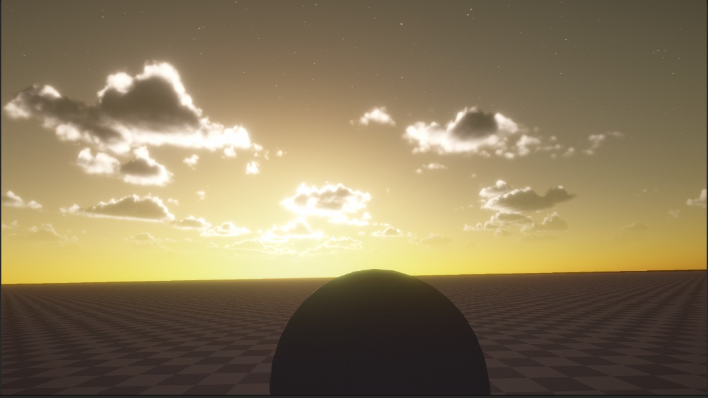
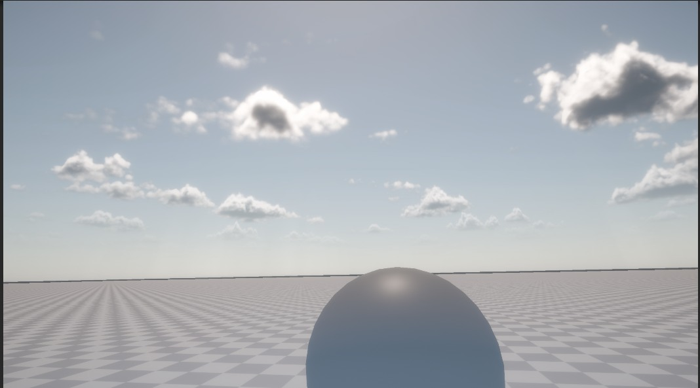
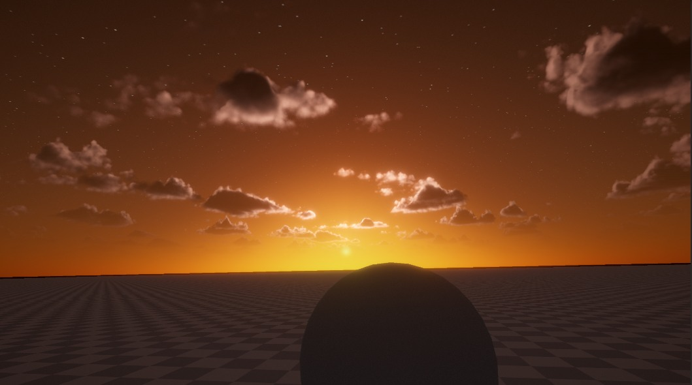
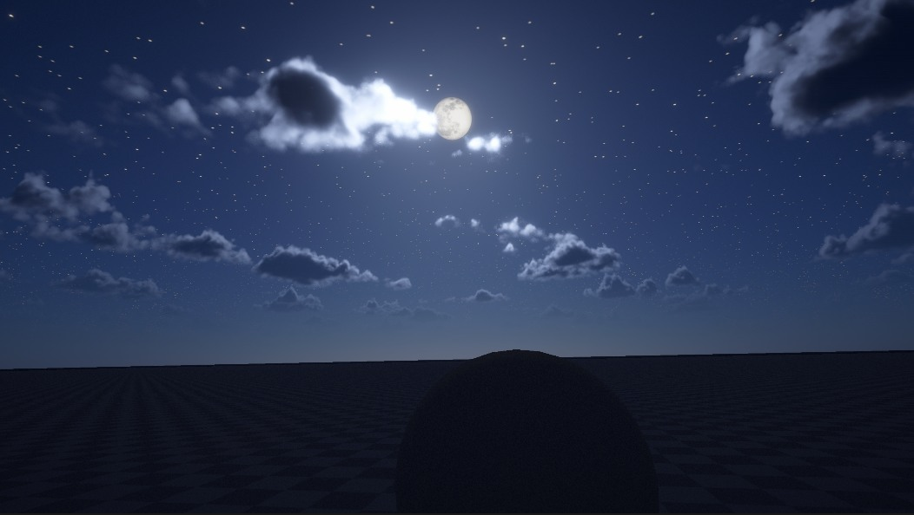

# Sky-Rendering

**Unity URP 实时动态天空渲染系统** / *Real-time dynamic sky rendering system on Unity URP*

以 **TOD（昼夜循环）** 为唯一驱动源，把 **大气散射 → 体积云 → 体积光** 串成一条自洽的光照链路。
Unity `2022.3.62f3c1` · URP `14.0.12` · 全部渲染效果为自写 HLSL shader + RendererFeature，无第三方渲染资产。

---

## 效果 / Gallery

| 清晨 Dawn | 正午 Noon |
|---|---|
|  |  |

| 黄昏 Dusk | 夜晚 Night |
|---|---|
|  |  |

---

## 简要思路 / Approach

1. **单一时间源 / Single time source**
   `TimeOfDay` 只改 Directional Light 的 transform / color / intensity 与 `RenderSettings.ambientLight`，
   下游全部经 `GetMainLight()` 派生（大气、云的 `GetCloudLight()`、体积光锚点）。
   不做"按时间直接写材质参数"的第二套曲线，避免两条时间线互相打架。

2. **按管线顺序传递数据 / Pass-order driven data flow**
   大气(400) → 云(450)：云从相机颜色缓冲水平三点采样取最暗值当 `bgColor`，同时充当空气透视雾色与天光环境源。
   全屏 blit pass 里 `SampleSH()` 近似为 0，用大气散射色当天光反而正午蓝、黄昏橙，与 TOD 天然自洽。
   体积光(550) 独立从主光/月亮方向反推屏幕空间锚点，与云无数据依赖。

3. **物理化光照 / Physically-based lighting**
   大气：Rayleigh/Mie 单次散射积分，视线方向光学厚度用解析解（`L·ρ(h₀)·(1-e⁻ᵏ)/k`）替代中点采样，消除地平线色带。
   体积云：球壳模式贴合地球曲率；Nubis 式密度管线（天气图覆盖率 → 3D 噪声塑形 → 顶部收敛/平底 → 高频 Worley 侵蚀 → curl 云底扭曲）；
   物理消光 Beer 透射 + 能量守恒双瓣 HG 相位，银边/糖粉暗边作为独立叠加项，不污染基础能量分布。

4. **用近似补足单次散射的破绽 / Faking the missing multiple scattering**
   太阳被地球遮挡时不硬截断，用 Chapman 擦边近似厚度平滑过渡（Terminator Fade），消掉日落后那条刀切黑线；
   云侧用 Ambient Trace（采样点向上 6 步短程 raymarch）补背光面局部层次；夜空用深夜兜底渐变防死黑。
   夜间统一以 `-sunDir` 作月亮方向二次调用同一散射函数。

---

## 文件构成 / File Layout

```
Assets/SkySystem/
├── Scripts/
│   ├── TimeOfDay.cs                 昼夜循环驱动器（挂 Directional Light）：转太阳角、改光色/强度、写环境光
│   ├── AtmosphereRenderFeature.cs   大气散射 RendererFeature，单 pass blit（Event 400）
│   ├── CloudRenderFeature.cs        体积云 RendererFeature，raymarch + 合成两 pass（Event 450）
│   ├── RadialBlur.cs                体积光 RendererFeature，高光提取 + 径向模糊两 pass（Event 550）
│   └── RuntimePerformanceMonitor.cs 左上角 FPS/显存/内存 HUD，与天空系统无耦合，仅调试用
├── Editor/
│   └── CloudNoiseBaker.cs           离线烘焙云用噪声，菜单 Tools/Cloud/*（原地覆盖保 GUID）
├── Shaders/
│   ├── skybox.shader                天空盒：太阳圆盘 / 月亮贴图 / 星空闪烁 / 6 时段昼夜渐变
│   ├── AtmosphereTest.shader        Rayleigh/Mie 单次散射 + 晨昏软化 + 月光二次调用 + 深夜兜底
│   ├── RenderCloudTest_Shape.shader 体积云核心：密度建模 + 物理化散射与透射
│   └── RadialBlur.shader            体积光：亮度阈值提取 + 径向模糊叠回
├── Materials/
│   ├── skybox.mat                   绑 skybox.shader
│   ├── atmophereTest.mat            绑 AtmosphereTest.shader
│   └── cloud_shape.mat              绑 RenderCloudTest_Shape.shader
├── Pipeline/
│   └── RayMarch.asset               URP RendererData，挂载上述三个 RendererFeature（执行顺序由 Event 决定，与列表顺序无关）
└── Textures/
    ├── blueNoise.png / moon.jpg / stars.png 等   抖动噪声、月面贴图、星空
    └── Baked/                                    烘焙产物，材质纹理槽直接引用
        ├── BaseNoise128.asset   R=Perlin-Worley，GBA=Worley FBM 三档
        ├── DetailNoise64.asset  三档 Worley FBM（高频侵蚀）
        ├── CurlNoise128.asset   2D curl 势场（云底丝絮）
        └── WeatherMap512.asset  低频天气团 / 高频云朵轮廓 / 云型

Assets/Scenes/SampleScene.unity      唯一场景：Main Camera / Directional Light(挂 TimeOfDay) / Global Volume / Terrain / Sphere
Docs/
├── AtmosphereShader说明.md           大气散射公式 ↔ Shader 代码逐行对照
└── Images/                          README 效果图
```

---

## 运行 / Getting Started

1. Unity **2022.3.62f3c1** 打开工程，打开 `Assets/Scenes/SampleScene.unity`，Play 即可看到昼夜循环
   （`TimeOfDay.dayLengthInMinutes` 控制一天长度，`autoPlay` 可关）。
2. 确认 `Project Settings → Graphics / Quality` 的管线资产指向 `Assets/SkySystem/Pipeline/RayMarch.asset`。
3. 重烘云噪声：菜单 `Tools/Cloud/Bake All Cloud Noise`。
4. 编辑器内看效果注意两点：非 Play 模式改 `currentTime` 后需手动触发一次 `UpdateTimeLighting()`；
   关闭 `useDivisionRendering` 并落盘，否则静态画面只有 1/16 像素在更新（网格马赛克）。

---

## 文档与许可 / Docs & License

- [`Docs/AtmosphereShader说明.md`](Docs/AtmosphereShader说明.md)：大气散射公式与代码逐行映射（含射线求交、解析积分推导附录）
- MIT License（见 [`LICENSE`](LICENSE)）
